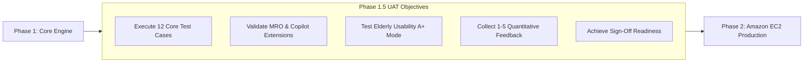

# HTC Core — Phase 1.5: User Acceptance Testing (UAT) Execution & Evaluation Guide

This document serves as the official **User Acceptance Testing (UAT) Walkthrough and Feedback Guide** for **Phase 1.5** of the HTC Core Management System. It provides operational staff, pilot testers, management, and UAT coordinators with step-by-step test execution scripts, persona responsibilities, and a quantitative evaluation questionnaire to evaluate system effectiveness before Phase 2 production deployment.

---

## 1. Executive Summary & Scope

Phase 1.5 establishes system readiness through comprehensive end-to-end testing across all completed modules:
1. **Core Operational Engine**: Sourcing clusters, contract parameters, logistics tracking, and variance alerts (> 1.0% tolerance).
2. **Financial & Reconciliation Tools**: Capital loan interest accruals, invoice generation, expense vouchers, and 3-step payment matching.
3. **Phase 1.5 Extensions**:
   - **MRO Linking Pipeline**: Binding Molasses Release Orders directly to clusters with volume balance tracking.
   - **HTC Copilot AI Assistant**: Natural language query engine using local Django ORM context scoping.
   - **Elderly-Friendly UI Audit**: High-contrast theme persistence and persistent High-Legibility Mode (`A+`).
4. **Security Hardening**: Two-Factor Authentication (2FA / TOTP), recovery backup codes, and admin approval workflows.

---

## 2. UAT Execution Pre-Requisites & Roles

### Test Environment Setup
- **URL**: `http://localhost/` (or staging server IP)
- **Database Status**: Pre-loaded with HTC operational spreadsheet dataset and seed users.
- **Default Test Password**: `htc2026`

### User Personas & Test Accounts

| Persona | Username | Role Key | Functional Focus Areas |
|---|---|---|---|
| **System Administrator** | `admin` | `administrator` | User approval, 2FA, system audit trail, database management |
| **Operations Manager** | `ops_mgmt` | `operations_management` | Sourcing clusters, logistics ledgers, variance disputes, MRO linking |
| **Operations Staff** | `operations` | `operations_management` | Cluster updates, deliveryreceipt uploads, Excel import |
| **Finance Specialist** | `finance` | `finance` | Capital loans, accrued interest, cash vouchers, payment matching |
| **Invoicing Clerk** | `invoicing` | `invoicing` | Sales invoice generation, billing tracking, PDF downloads |

---

## 3. Step-by-Step UAT Test Execution Scripts

### TC-01: User Self-Registration & Administrator Approval Workflow
* **Target Role**: New User & System Administrator
* **Objective**: Verify that newly registered users remain inactive until explicitly approved by an administrator.
* **Test Steps**:
  1. Navigate to `/accounts/signup/` and submit registration details for `test_user_01`.
  2. Attempt to sign in immediately with `test_user_01` (Verify login is blocked with message: *"Account pending Administrator approval"*).
  3. Sign out and log in as `admin` (`htc2026`).
  4. Navigate to `/accounts/users/`, locate `test_user_01`, assign role (`operations_management`), and click **Approve & Activate**.
  5. Log out and log back in as `test_user_01`.
* **Expected Result**: User is successfully blocked until admin approval, after which login proceeds normally.

---

### TC-02: Two-Factor Authentication (2FA / TOTP) Setup & Verification
* **Target Role**: All Authenticated Users
* **Objective**: Confirm TOTP 2FA enrollment, QR code scanning, single-use recovery codes, and verification enforcement.
* **Test Steps**:
  1. Log in as `operations` (`htc2026`) and navigate to User Profile (`/accounts/profile/`).
  2. Click **Setup Two-Factor Authentication (2FA)**.
  3. Scan the generated QR code using Google Authenticator, Authy, or Microsoft Authenticator.
  4. Enter the 6-digit TOTP code and click **Activate 2FA**.
  5. Copy and securely store the 5 displayed single-use backup recovery codes.
  6. Log out and log back in (Verify redirection to `/accounts/two-factor-verify/`).
  7. Enter valid 6-digit TOTP code to complete login.
* **Expected Result**: 2FA enforcement redirects user to verification screen and grants session access upon valid code entry.

---

### TC-03: Operational Cluster Sourcing & Volume Variance Tracking
* **Target Role**: Operations Manager
* **Objective**: Test transaction cluster creation, driver haulage updates, and automatic 1.0% variance tolerance alerts.
* **Test Steps**:
  1. Navigate to `/operations/` and click **Create Transaction Cluster**.
  2. Enter client (`San Miguel Corp`), sugar mill (`BUSCO`), loaded volume (`100.00 MT`), and unit prices.
  3. Open the newly created cluster detail view (`/operations/<pk>/`).
  4. Click **Update Logistics** and enter received volume (`98.50 MT`) — incurring a **1.50% variance**.
  5. Submit logistics update and verify the page warning banner.
* **Expected Result**: System automatically flags `1.50%` variance, highlights variance alert banner in crimson, and sets dispute flag.

---

### TC-04: Excel Import & Bulk Spreadsheet Processing
* **Target Role**: Operations Staff & Administrator
* **Objective**: Confirm parsing of HTC summary Excel workbooks into staged database ledgers without data loss.
* **Test Steps**:
  1. Navigate to `/operations/import/`.
  2. Select the HTC Master Summary workbook (`htc-summary.xlsx`).
  3. Click **Preview Staged Import**.
  4. Review parsed rows, total volume metrics, and contract terms.
  5. Click **Confirm & Commit Staged Import**.
* **Expected Result**: All workbook rows are committed to database, generating active clusters and logistics ledgers.

---

### TC-05: Molasses Release Order (MRO) Permit Linking Pipeline
* **Target Role**: Operations Manager
* **Objective**: Bind supplier MRO release permits to a transaction cluster and monitor remaining volume balances.
* **Test Steps**:
  1. Navigate to `/operations/mro-summary/` and inspect active MRO permits.
  2. Open an active cluster detail page (`/operations/<pk>/`).
  3. In the **Linked Molasses Release Orders** card, click **Link MRO Permit**.
  4. Select an unassigned MRO permit (e.g. `MRO #000731`) from the dropdown and click **Bind Permit to Cluster**.
  5. Verify that linked MRO table displays permit number, planter name, and total allocated tonnage.
  6. Click **MRO Summary** in navigation and verify the blue cluster badge link attached to `MRO #000731`.
* **Expected Result**: MRO permit is successfully bound to the cluster, updates allocated tonnage, and creates clickable deep links across ledgers.

---

### TC-06: HTC Copilot AI Assistant Operational Queries (Local ORM)
* **Target Role**: Operations & Finance Users
* **Objective**: Verify natural language query processing, role-scoped data security, and clickable system deep links.
* **Test Steps**:
  1. Click **HTC Copilot** in the topbar navigation to open the slide-over drawer.
  2. Click prompt pill: **High Variances** (*"Show high variance clusters"*).
  3. Verify Copilot returns matching disputed clusters with direct `[Inspect]` buttons.
  4. Type custom query: *"Check overdue loans"*.
  5. Verify Copilot displays active capital loan principal balances and interest rates (if user has Finance role).
  6. Click prompt pill: **MRO Balances** (*"Unassigned MRO permits"*).
* **Expected Result**: HTC Copilot evaluates queries locally via Django ORM and returns accurate data scoped to user permissions.

---

### TC-07: Sales Invoice Generation & PDF Export
* **Target Role**: Invoicing Clerk
* **Objective**: Issue customer sales invoices and generate downloadable PDF invoices.
* **Test Steps**:
  1. Open a transaction cluster detail page (`/operations/<pk>/`).
  2. Scroll to **Sales Invoices** panel and click **Create Invoice**.
  3. Enter invoice serial number (`INV-2026-088`), date, and billed amount.
  4. Submit form and verify invoice status displays `UNPAID`.
  5. Click **Download PDF Report** in topbar action panel.
* **Expected Result**: Invoice is saved, linked to cluster, and official PDF report generates with full financial breakdown.

---

### TC-08: Capital Loan Facilities & Accrued Interest Tracking
* **Target Role**: Finance Specialist
* **Objective**: Record capital sourcing loans, track dynamic daily interest accruals, and perform settlement verification.
* **Test Steps**:
  1. Navigate to `/finance/loans/` and click **Record Capital Loan**.
  2. Select target cluster, lender name, principal (`₱1,000,000`), annual interest rate (`12.0%`), and release date.
  3. Submit loan record and view active loan card.
  4. Verify calculated accrued interest updates based on elapsed days.
  5. Click **Settle Loan** and confirm principal + interest repayment.
* **Expected Result**: Accrued interest calculates dynamically and settlement updates loan status to `SETTLED`.

---

### TC-09: 3-Step Payment-to-Expense Reconciliation Matching
* **Target Role**: Finance Specialist
* **Objective**: Pair customer bank payments against supplier expense vouchers to compute deal net profit margin.
* **Test Steps**:
  1. Navigate to `/finance/reconciliation/` (or click **Payment Matching** from cluster detail).
  2. Step 1: Record customer bank payment (`₱4,350,000`).
  3. Step 2: Record cash voucher payment for driver trucking (`₱50,000`).
  4. Step 3: Create a reconciliation match pairing the payment against the expense voucher.
  5. Verify remaining unallocated payment balance.
* **Expected Result**: Reconciliation match is saved and deal net profit is updated.

---

### TC-10: Team Chat & Contextual Operational Threads
* **Target Role**: All Authenticated Users
* **Objective**: Validate real-time employee communication and direct message delivery.
* **Test Steps**:
  1. Click **Chat** (`/chat/`) in sidebar navigation.
  2. Select a team member from the directory and send a direct message.
  3. Switch to a specific transaction cluster discussion thread and post an update (*"Barge MV Aurora loaded 100 MT"*).
* **Expected Result**: Messages deliver instantly and topbar notification badges update.

---

### TC-11: System Audit Log & Security Inspection
* **Target Role**: System Administrator
* **Objective**: Review immutable audit trail logs tracking user actions, entity creations, and field updates.
* **Test Steps**:
  1. Log in as `admin` and navigate to `/audit/`.
  2. Filter audit records by action type (`CREATE`, `UPDATE`, `DELETE`) or username (`operations`).
  3. Inspect change details for a modified transaction cluster.
* **Expected Result**: Immutable audit table displays exact user, timestamp, table, and changed fields.

---

### TC-12: High-Legibility Elderly Usability Mode (`A+`) & Theme Persistence
* **Target Role**: All Users
* **Objective**: Validate accessibility font scaling, high-contrast themes, enlarged touch targets (48px), and persistent settings.
* **Test Steps**:
  1. Click **`A+`** in topbar navigation to enable **High Legibility Mode**.
  2. Verify text scales to 17px body base, touch targets expand to 48px, and color contrast sharpens.
  3. Click **Moon/Sun** icon to toggle between Dark and Light mode.
  4. Refresh page or navigate across different modules (`/finance/`, `/operations/`).
* **Expected Result**: Legibility mode (`A+`) and dark/light theme choices persist across page reloads in `localStorage`.

---

## 4. Quantitative Evaluation & Feedback Questionnaire (Scale 1–5)

To evaluate how effectively the HTC Core Management System integrates with Heindrich Trading Corporation's business processes, UAT participants are requested to complete the following **1-to-5 Likert Scale Evaluation**.

### Rating Scale Reference
- **1 — Poor / Disagree**: Does not meet operational requirements; major friction.
- **2 — Fair / Somewhat Disagree**: Needs improvement; partial functionality.
- **3 — Satisfactory / Neutral**: Meets basic expectations; acceptable performance.
- **4 — Good / Agree**: Performs well; smooth integration with company processes.
- **5 — Excellent / Strongly Agree**: Outstanding performance; significantly enhances productivity.

---

### Section A: Operational Effectiveness & Accuracy

| # | Evaluation Question | Score (1–5) | Evaluator Comments |
|---|---|:---:|---|
| **A1** | **Volume Variance Tracking**: How effectively does the system compute shrinkage percentages and flag tolerance alerts (> 1.0%)? | `[  ]` | |
| **A2** | **MRO Permit Linking**: How clearly does the MRO pipeline track assigned release permits and remaining volume balances? | `[  ]` | |
| **A3** | **Excel Import Utility**: How reliably does the bulk spreadsheet import parse and stage operational contract data? | `[  ]` | |
| **A4** | **Data Integrity**: How confident are you in the system's accuracy regarding volume calculations, costs, and audit logs? | `[  ]` | |

---

### Section B: Workflow Alignment & Business Fit

| # | Evaluation Question | Score (1–5) | Evaluator Comments |
|---|---|:---:|---|
| **B1** | **Procurement-to-Delivery Process**: How seamlessly does the system mirror HTC's actual molasses sourcing & haulage workflow? | `[  ]` | |
| **B2** | **Financial Reconciliation Fit**: How well does the 3-step payment matching (bank receipt vs. expense voucher) fit HTC's accounting? | `[  ]` | |
| **B3** | **Capital Loan Management**: How effectively does the loan facility track dynamic interest accruals and settlements? | `[  ]` | |
| **B4** | **Cross-Department Collaboration**: How well do the role-scoped navigation and team chat facilitate coordination between Operations & Finance? | `[  ]` | |

---

### Section C: UI/UX Usability, Accessibility & Elderly Eye Compatibility

| # | Evaluation Question | Score (1–5) | Evaluator Comments |
|---|---|:---:|---|
| **C1** | **High-Legibility Mode (`A+`)**: How effective is the `A+` font scaling toggle in improving legibility for older or low-vision staff? | `[  ]` | |
| **C2** | **Visual Contrast & Hierarchy**: Are text colors, dark/light themes, and status badges sharp, clear, and easy on the eyes? | `[  ]` | |
| **C3** | **Touch & Button Targets**: Are buttons, form fields, and dropdowns spacious (48px targets) and easy to click/tap without errors? | `[  ]` | |
| **C4** | **Navigation & Layout Intuitiveness**: How easy is it for non-technical users to navigate between clusters, MROs, and reports? | `[  ]` | |

---

### Section D: AI Web Assistant (HTC Copilot) Utility

| # | Evaluation Question | Score (1–5) | Evaluator Comments |
|---|---|:---:|---|
| **D1** | **Query Relevance**: How accurately does HTC Copilot answer natural language questions (variances, loans, MRO balances)? | `[  ]` | |
| **D2** | **Actionable Deep Links**: How helpful are the generated links (`[Inspect]`, `[View Ledger]`) in navigating directly to target records? | `[  ]` | |
| **D3** | **Speed & Responsiveness**: How satisfied are you with Copilot's local ORM execution speed (sub-second response time)? | `[  ]` | |

---

### Section E: Overall Satisfaction & Production Readiness

| # | Evaluation Question | Score (1–5) | Evaluator Comments |
|---|---|:---:|---|
| **E1** | **Overall System Value**: Overall, how valuable is HTC Core in improving operational efficiency and reducing manual errors? | `[  ]` | |
| **E2** | **Phase 2 Production Readiness**: How ready is the system for Phase 2 deployment on AWS EC2 cloud infrastructure? | `[  ]` | |

---

## 5. UAT Defect Classification & Sign-Off Criteria

### Defect Severity Definitions

| Severity Level | Name | Definition | Action Required |
|---|---|---|---|
| **Severity 1** | **Critical** | System crash, data loss, incorrect financial formula, or auth security breach. | Must resolve before Phase 2 release. |
| **Severity 2** | **Major** | Core feature malfunction or missing operational constraint with no work-around. | High priority patch before sign-off. |
| **Severity 3** | **Minor** | Cosmetic misalignment, non-blocking typo, or minor UI padding preference. | Add to Phase 2 polish backlog. |

---

### Final Sign-Off Criteria Checklist

- [ ] **100% Execution**: All 12 UAT test scripts executed across assigned roles.
- [ ] **Pass Rate**: Minimum **>= 95% test script pass rate**.
- [ ] **Zero Critical Defects**: 0 open Severity 1 or Severity 2 defects remaining.
- [ ] **Quantitative Score**: Average quantitative evaluation rating of **>= 4.0 out of 5.0**.
- [ ] **Formal Approval**: Signed UAT sign-off document from HTC Operations Lead and Project Architect.

---

### Sign-Off Approvals

| Role | Name | Signature | Date |
|---|---|---|---|
| **HTC Operations Manager** | ___________________________ | ___________________ | ____ / ____ / 2026 |
| **HTC Lead Finance Officer** | ___________________________ | ___________________ | ____ / ____ / 2026 |
| **Lead Project Architect** | ___________________________ | ___________________ | ____ / ____ / 2026 |
