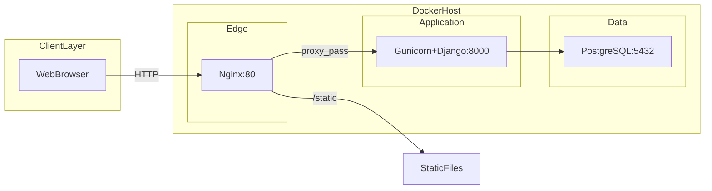

# Docker containerization — HTC Core

This maps the running containers to your capstone **Figure 3.4 System Architecture** (NGINX → Gunicorn → Django → PostgreSQL).

## Architecture diagram (MVP pilot)



## Container map

| Container | Image / build | Role in paper | Port |
|-----------|---------------|---------------|------|
| `nginx` | `nginx:1.27-alpine` | Reverse proxy, static files | **80** (public) |
| `web` | `Dockerfile` (Python 3.12) | Gunicorn + Django app server | 8000 (internal) |
| `db` | `postgres:16-alpine` | PostgreSQL relational DB | 5432 (internal) |

Phase 2 overlay (`docker-compose.phase2.yml`):

| Container | Role in paper |
|-----------|---------------|
| `redis` | In-memory broker (Celery) |
| `worker` | Celery background workers |

## Prerequisites

1. Install [Docker Desktop](https://www.docker.com/products/docker-desktop/) on Windows.
2. Start Docker Desktop (required — `docker compose` fails if the engine is not running).

## Run the pilot stack

```powershell
cd c:\Users\Gigabyte\HTC
docker compose up --build
```

Open **http://localhost** (port 80 via Nginx, not 8000).

First boot runs:

1. `migrate` — create PostgreSQL tables
2. `collectstatic` — bundle CSS (including Figma theme file)
3. `seed_demo` — sanitized UAT data
4. `gunicorn` — start Django WSGI workers

Stop:

```powershell
docker compose down
```

Reset database:

```powershell
docker compose down -v
docker compose up --build
```

## Run Phase 2 stack (Celery + Redis)

Only after Celery is implemented in Django:

```powershell
docker compose -f docker-compose.yml -f docker-compose.phase2.yml up --build
```

## AWS EC2 deployment (production)

Your paper targets AWS EC2. Typical flow:

1. Launch Ubuntu EC2 instance (t3.small or larger).
2. Install Docker on the instance.
3. Clone repo, copy `.env` with production `SECRET_KEY` and strong DB password.
4. Open EC2 security group: inbound **80** (HTTP) and **443** (HTTPS if you add TLS).
5. Run `docker compose up -d --build`.
6. Point domain or staff IP to the instance public IP.

For HTTPS, add Certbot on the host or an `nginx` TLS block — document in Chapter 4 as deployment hardening.

## File reference

| File | Purpose |
|------|---------|
| `Dockerfile` | Builds Python app image, runs `collectstatic` |
| `docker-compose.yml` | MVP: db + web + nginx |
| `docker-compose.phase2.yml` | Optional redis + celery worker |
| `nginx/nginx.conf` | Proxy to Gunicorn, serve `/static/` |
| `.env.example` | Template for secrets and `DATABASE_URL` |

## Troubleshooting

| Issue | Fix |
|-------|-----|
| `dockerDesktopLinuxEngine` pipe error | Start Docker Desktop |
| Static CSS not loading | `docker compose exec web python manage.py collectstatic --noinput` |
| Login works on 8000 but not 80 | Use port 80; Gunicorn is not exposed in MVP compose |
| DB connection refused | Wait for `db` healthcheck; check `DATABASE_URL` uses host `db` |
