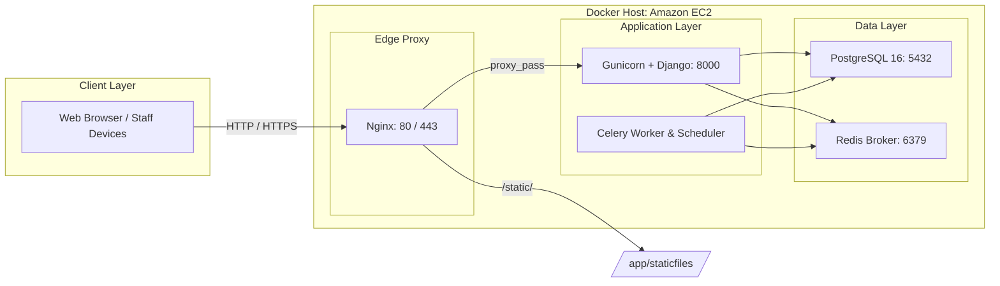

# Docker Container Topology & AWS EC2 Host Guide — HTC Core

This document details the multi-container Docker architecture (NGINX → Gunicorn WSGI → Django App → PostgreSQL 16 + Redis Broker + Celery Worker) and production deployment procedures on **Amazon EC2**.

---

## 1. System Architecture Topology


```mermaid
flowchart LR
    subgraph client [Client Layer]
        Browser[Web Browser / Staff Devices]
    end
    subgraph docker [Docker Host: Amazon EC2]
        subgraph edge [Edge Proxy]
            Nginx[Nginx: 80 / 443]
        end
        subgraph app [Application Layer]
            Gunicorn[Gunicorn + Django: 8000]
            Celery[Celery Worker & Scheduler]
        end
        subgraph data [Data Layer]
            Postgres[PostgreSQL 16: 5432]
            Redis[Redis Broker: 6379]
        end
    end

    Browser -->|HTTP / HTTPS| Nginx
    Nginx -->|proxy_pass| Gunicorn
    Nginx -->|/static/| StaticFiles[/app/staticfiles/]
    Gunicorn --> Postgres
    Gunicorn --> Redis
    Celery --> Redis
    Celery --> Postgres
```

---

## 2. Active Container Map (`docker-compose.yml`)

| Container | Base Image | Purpose | Port Mapping |
| :--- | :--- | :--- | :--- |
| **`nginx`** | `nginx:1.27-alpine` | Edge reverse proxy, SSL termination & static asset server | **80:80**, **443:443** (Public) |
| **`web`** | `Dockerfile` (Python 3.12) | Gunicorn WSGI server & Django application logic | **8000** (Internal network) |
| **`db`** | `postgres:16-alpine` | PostgreSQL relational database engine | **5432** (Internal network) |
| **`redis`** | `redis:alpine` | In-memory message broker for task queues | **6379** (Internal network) |
| **`celery_worker`** | `Dockerfile` (Python 3.12) | Asynchronous task execution & nightly scheduler | Internal runner |

---

## 3. Local Development Stack Management

### Start All Services
```powershell
docker compose up --build -d
```
Access the application at **http://localhost** (serviced via Nginx on port 80).

### Check Container Status & Logs
```powershell
docker compose ps
docker compose logs -f web
```

### Stop Services & Clean Volumes
```powershell
docker compose down
# To wipe local PostgreSQL volume and start fresh:
docker compose down -v
```

---

## 4. Production Deployment on Amazon EC2 (AWS)

### Step 1: EC2 Host Setup
1. Launch an AWS EC2 instance:
   - **OS:** Ubuntu 24.04 LTS (x86_64)
   - **Instance Type:** `t3.small` (2 vCPU, 2 GB RAM) or `t3.medium`
   - **Storage:** 20 GB GP3 EBS Volume
2. Attach an **Elastic IP (EIP)** to the instance.
3. Configure Security Group Rules:
   - `HTTP` (Port 80) — Anywhere (`0.0.0.0/0`)
   - `HTTPS` (Port 443) — Anywhere (`0.0.0.0/0`)
   - `SSH` (Port 22) — Restricted to Admin IP

### Step 2: Host Preparation & Automated Deployment
Connect via SSH and execute deployment automation:
```bash
# Clone application repository
git clone https://github.com/porogami63/CAPSTONE-2.0.git /opt/htc-core
cd /opt/htc-core

# Create production environment variables
cp .env.production.example .env

# Run automated deployment script
chmod +x scripts/deploy_ec2.sh
./scripts/deploy_ec2.sh
```

---

## 5. File Reference

| File | Purpose |
| :--- | :--- |
| [`Dockerfile`](../Dockerfile) | Python 3.12 container build definition |
| [`docker-compose.yml`](../docker-compose.yml) | Multi-container stack configuration |
| [`nginx/nginx.conf`](../nginx/nginx.conf) | Nginx edge proxy & static asset routing |
| [`scripts/deploy_ec2.sh`](../scripts/deploy_ec2.sh) | Automated EC2 host deployment script |
| [`.env.production.example`](../.env.production.example) | Production environment variable template |
