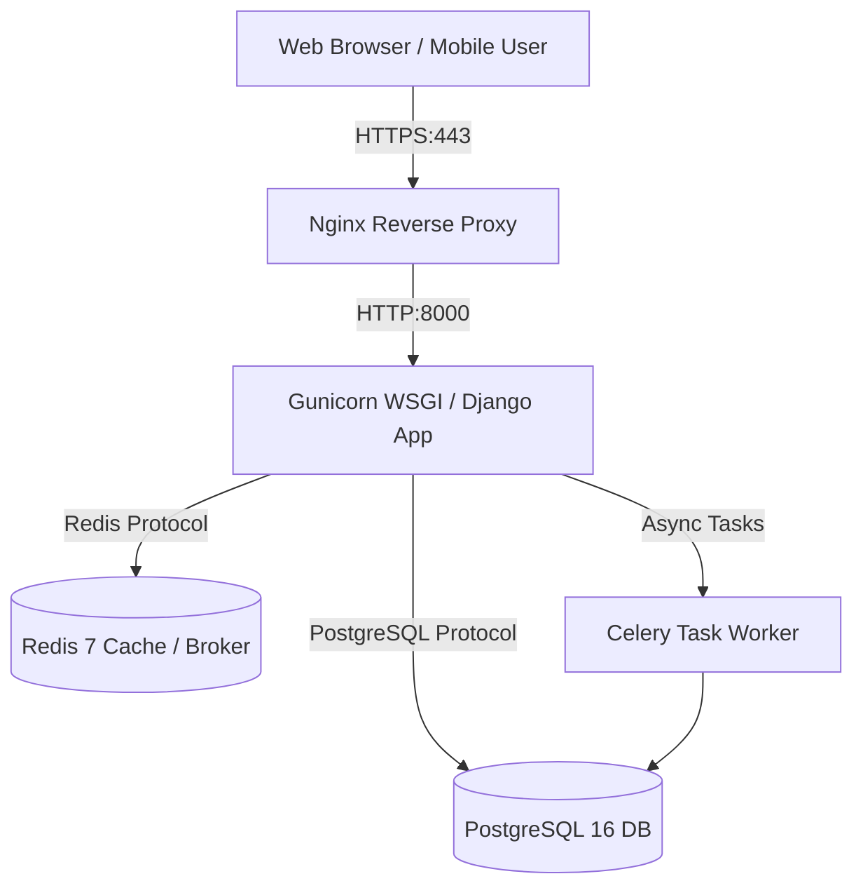

# 🚀 HTC Core — Amazon EC2 Production Deployment Guide (Phase 2)

This document provides a step-by-step operational guide for deploying the **HTC Core Management System** onto an **Amazon EC2 (AWS)** instance using Docker Compose, Nginx, PostgreSQL, Redis, Celery, and SSL (Let's Encrypt).

---

## 📋 System Requirements & Architecture Overview



### Recommended EC2 Hardware Specifications:
* **Instance Type**: `t3.medium` (2 vCPU, 4GB RAM) or `t3.large` (8GB RAM) for higher concurrency.
* **Operating System**: **Ubuntu 24.04 LTS** (64-bit x86) or **Amazon Linux 2023**.
* **Storage**: 30 GB EBS General Purpose SSD (`gp3`).
* **Elastic IP**: Allocated static public IP address.

---

## Step 1: AWS Provisioning & Security Group Setup

### 1.1 Launching the EC2 Instance
1. Log in to the [AWS Management Console](https://aws.amazon.com/console/) and open the **EC2 Dashboard**.
2. Click **Launch Instance**.
3. **Name**: `HTC-Core-Production-Server`.
4. **AMI**: Select **Ubuntu Server 24.04 LTS (HVM), SSD Volume Type**.
5. **Instance Type**: Select `t3.medium` (or `t3.large`).
6. **Key Pair**: Select or create an SSH key pair (e.g., `htc-core-ec2-key.pem`). Download and store it securely.

### 1.2 Security Group Configuration (Firewall Rules)
In the Network Settings step, create a new Security Group named `htc-core-prod-sg` with the following inbound rules:

| Type | Protocol | Port Range | Source | Description |
|---|---|---|---|---|
| **SSH** | TCP | `22` | My IP (or Admin Subnet) | Secure SSH Admin Access |
| **HTTP** | TCP | `80` | `0.0.0.0/0` | Web Traffic (Auto-redirect to HTTPS) |
| **HTTPS** | TCP | `443` | `0.0.0.0/0` | SSL Encrypted Web Traffic |

### 1.3 Allocate & Associate Elastic IP
1. Under EC2 left sidebar, go to **Network & Security** $\rightarrow$ **Elastic IPs**.
2. Click **Allocate Elastic IP address** $\rightarrow$ Click **Allocate**.
3. Select the allocated Elastic IP $\rightarrow$ Click **Actions** $\rightarrow$ **Associate Elastic IP address**.
4. Select your `HTC-Core-Production-Server` instance and click **Associate**.

---

## Step 2: EC2 Server Initialization & Dependencies

### 2.1 SSH into your EC2 Instance
Open your terminal (or PowerShell) and connect to your instance:

```bash
# Set secure permission for your SSH key (Linux/macOS)
chmod 400 htc-core-ec2-key.pem

# SSH into EC2 instance
ssh -i "htc-core-ec2-key.pem" ubuntu@YOUR_ELASTIC_IP
```

### 2.2 System Package Update & Docker Installation
Once logged in, execute the following commands to update Ubuntu packages and install Docker:

```bash
# 1. Update system packages
sudo apt update && sudo apt upgrade -y

# 2. Install essential utilities
sudo apt install -y curl git ufw ca-certificates gnupg lsb-release

# 3. Add Docker’s official GPG key & repository
sudo install -m 0755 -d /etc/apt/keyrings
curl -fsSL https://download.docker.com/linux/ubuntu/gpg | sudo gpg --dearmor -o /etc/apt/keyrings/docker.gpg
sudo chmod a+r /etc/apt/keyrings/docker.gpg

echo \
  "deb [arch=$(dpkg --print-architecture) signed-by=/etc/apt/keyrings/docker.gpg] https://download.docker.com/linux/ubuntu \
  $(. /etc/os-release && echo "$VERSION_CODENAME") stable" | \
  sudo tee /etc/apt/sources.list.d/docker.list > /dev/null

# 4. Install Docker Engine, CLI, and Docker Compose Plugin
sudo apt update
sudo apt install -y docker-ce docker-ce-cli containerd.io docker-buildx-plugin docker-compose-plugin

# 5. Add 'ubuntu' user to docker group (no need for sudo docker)
sudo usermod -aG docker ubuntu

# 6. Apply group changes (or log out and back in)
newgrp docker

# 7. Verify Docker installation
docker --version
docker compose version
```

---

## Step 3: Repository Setup & Environment Configuration

### 3.1 Clone the Codebase
Clone the project repository to `/var/www/` or your home directory:

```bash
cd /home/ubuntu
git clone https://github.com/porogami63/CAPSTONE-2.0.git htc-core
cd htc-core
```

### 3.2 Configure Production Environment Variables (`.env`)
Create the production `.env` file from `.env.production.example`:

```bash
cp .env.production.example .env
nano .env
```

Generate a secure Django Secret Key:
```bash
python3 -c 'import secrets; print(secrets.token_urlsafe(50))'
```

Update your `.env` file with secure values:
```env
# Production Environment Settings
DEBUG=False
SECRET_KEY=YOUR_GENERATED_SECRET_KEY_HERE
ALLOWED_HOSTS=YOUR_DOMAIN.com,YOUR_ELASTIC_IP,localhost,127.0.0.1,nginx

# PostgreSQL Database Configuration
POSTGRES_DB=htc_core
POSTGRES_USER=htc_prod_user
POSTGRES_PASSWORD=YOUR_STRONG_DATABASE_PASSWORD
DATABASE_URL=postgres://htc_prod_user:YOUR_STRONG_DATABASE_PASSWORD@db:5432/htc_core

# Celery & Redis Task Broker
CELERY_BROKER_URL=redis://redis:6379/0
CELERY_RESULT_BACKEND=redis://redis:6379/0
CELERY_TASK_ALWAYS_EAGER=False
CELERY_TASK_EAGER_PROPAGATES=False

# Security
SECURE_SSL_REDIRECT=False
```
*(Save and exit nano: `Ctrl+O` $\rightarrow$ `Enter` $\rightarrow$ `Ctrl+X`)*

---

## Step 4: Docker Container Deployment & Initialization

### 4.1 Launch Production Containers
Run Docker Compose with both base and Phase 2 production configurations:

```bash
docker compose -f docker-compose.yml -f docker-compose.phase2.yml up --build -d
```

### 4.2 Verify Container Status
Check that all 5 core production containers are running and healthy:

```bash
docker compose ps
```

Expected output:
```text
NAME                     STATUS                   PORTS
capstone-2-db-1          Up (healthy)             5432/tcp
capstone-2-redis-1       Up (healthy)             6379/tcp
capstone-2-web-1         Up (healthy)             8000/tcp
capstone-2-nginx-1       Up                       0.0.0.0:80->80/tcp, 0.0.0.0:443->443/tcp
capstone-2-worker-1      Up                       
```

---

## Step 5: Domain Mapping & SSL Certificate Setup (Certbot / Let's Encrypt)

### 5.1 Point DNS Domain to Elastic IP
Go to your domain provider (e.g. Namecheap, GoDaddy, Cloudflare) and create an **A Record**:
* **Host**: `@` (or `htc`)
* **Value**: `YOUR_ELASTIC_IP`
* **TTL**: Auto / 5 mins

### 5.2 Install Certbot & Obtain Free SSL Certificate
Install Certbot on the EC2 host:

```bash
sudo apt install -y certbot python3-certbot-nginx

# Obtain SSL Certificate (Replace yourdomain.com with your actual domain)
sudo certbot --nginx -d yourdomain.com -d www.yourdomain.com
```

Follow the prompts:
1. Enter admin email for renewal notices.
2. Accept Terms of Service.
3. Select option **2: Redirect all HTTP requests to HTTPS**.

### 5.3 Verify Auto-Renewal
Certbot automatically installs a systemd timer for SSL renewal. Test it using:

```bash
sudo certbot renew --dry-run
```

---

## Step 6: System Auto-Start & Daily Database Backups

### 6.1 Setup Systemd Auto-Start on Reboot
Create a systemd service to ensure HTC Core automatically restarts if the EC2 instance reboots:

```bash
sudo nano /etc/systemd/system/htc-core.service
```

Paste the following service configuration:
```ini
[Unit]
Description=HTC Core Docker Compose Application Service
Requires=docker.service
After=docker.service network.target

[Service]
Type=oneshot
RemainAfterExit=yes
WorkingDirectory=/home/ubuntu/htc-core
ExecStart=/usr/bin/docker compose -f docker-compose.yml -f docker-compose.phase2.yml up -d
ExecStop=/usr/bin/docker compose -f docker-compose.yml -f docker-compose.phase2.yml down
TimeoutStartSec=0

[Install]
WantedBy=multi-user.target
```

Enable and start the service:
```bash
sudo systemctl daemon-reload
sudo systemctl enable htc-core.service
```

---

### 6.2 Setup Daily Database Backup Cron Job
Create an automated database backup script to save daily PostgreSQL dumps:

```bash
mkdir -p /home/ubuntu/backups
nano /home/ubuntu/backups/backup_db.sh
```

Paste script:
```bash
#!/bin/bash
BACKUP_DIR="/home/ubuntu/backups"
TIMESTAMP=$(date +"%Y%m%d_%H%M%S")
FILENAME="$BACKUP_DIR/htc_core_db_$TIMESTAMP.sql.gz"

# Execute pg_dump inside Postgres container
docker exec -t capstone-2-db-1 pg_dump -U htc_prod_user htc_core | gzip > "$FILENAME"

# Delete backups older than 14 days to preserve disk space
find "$BACKUP_DIR" -type f -name "*.sql.gz" -mtime +14 -delete

echo "Backup created: $FILENAME"
```

Make executable and schedule in `crontab`:
```bash
chmod +x /home/ubuntu/backups/backup_db.sh

# Edit crontab
crontab -e
```

Add line to run backup every midnight at 2:00 AM:
```cron
0 2 * * * /home/ubuntu/backups/backup_db.sh > /dev/null 2>&1
```

---

## Step 7: How to Update / Redeploy Code Changes

When you push new updates to your GitHub repository, redeploy to EC2 using this 3-step sequence:

```bash
cd /home/ubuntu/htc-core

# 1. Pull latest code
git pull origin main

# 2. Rebuild containers and run static/migration updates
docker compose -f docker-compose.yml -f docker-compose.phase2.yml up --build -d

# 3. Check health status
docker compose ps
```

---

## 🔍 Useful Maintenance Commands

```bash
# View live application logs
docker compose logs -f web

# View live Nginx web server logs
docker compose logs -f nginx

# View Celery worker logs
docker compose logs -f worker

# Execute Django shell inside live container
docker compose exec web python manage.py shell

# Restart all services
docker compose restart
```
