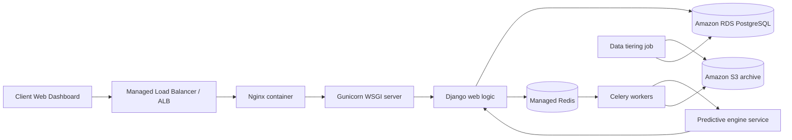

# HTC Core Phase 2 Architecture Plan

This document maps the remaining parts of the proposed system architecture to concrete implementation work. It separates the current MVP pilot from the future cloud-native target so the capstone paper and the codebase stay aligned.

## Current status

The repository currently implements the MVP pilot:

- Nginx reverse proxy
- Gunicorn + Django web app
- PostgreSQL relational database
- Management UI for transactions, finance, master data, audit, and dashboard
- Excel import for legacy workbook ingestion

The following diagram items are still conceptual and belong in Phase 2:

- ALB / managed load balancing
- ECS or Fargate hosting
- Redis broker and Celery worker separation
- S3 archive tier for cold and historical data
- RDS-managed PostgreSQL
- Predictive engine service
- Automated data tiering / archival orchestration

## Phase 2 target architecture

## File-by-file Phase 2 plan

| File | Phase 2 role | What to add |
|------|--------------|-------------|
| [config/settings.py](../config/settings.py) | Runtime configuration | Split environment settings for ECS/Fargate, Redis broker, S3 storage, and RDS connection strings. Keep eager Celery as the local default only. |
| [docker-compose.phase2.yml](../docker-compose.phase2.yml) | Local cloud-emulation stack | Extend to include the Celery worker, Redis, and optional archive/test services that mirror production dependencies. |
| [operations/tasks.py](../operations/tasks.py) | Operational async jobs | Move variance recalculation and import follow-up work into tasks so the web request stays thin. |
| [finance/tasks.py](../finance/tasks.py) | Finance async jobs | Schedule interest accrual, aging refresh, and payment matching jobs through Celery instead of request-time execution. |
| [audit/signals.py](../audit/signals.py) | Audit persistence boundary | Add archival hooks so selected historical audit rows can be exported to S3 without breaking the append-only trail. |
| [operations/services/excel_import.py](../operations/services/excel_import.py) | Ingestion pipeline | Add preview, validation, duplicate detection, and staged import results before commit. |
| [dashboard/views.py](../dashboard/views.py) | Management visibility | Add Phase 2 system-health indicators for queue depth, import status, and archive counts. |
| [README.md](../README.md) | User-facing documentation | Link the new roadmap and separate “MVP live” from “Phase 2 planned.” |

## Implementation sequence

1. Keep the current MVP stack stable and document it as the pilot baseline.
2. Introduce Redis and Celery in the Phase 2 compose overlay.
3. Move long-running recalculations and interest accrual into scheduled tasks.
4. Add S3 archival for audit/history data with a retention policy.
5. Swap the local Postgres pilot for managed RDS in the production deployment guide.
6. Add the predictive service only after the core async jobs are working and observable.

## Scope note

The predictive engine in the diagram is not yet a required build item. It should be treated as a separate service only if the capstone deliverable needs forecasting or supplier recommendation features. Otherwise, it stays a documented extension rather than a hard dependency.