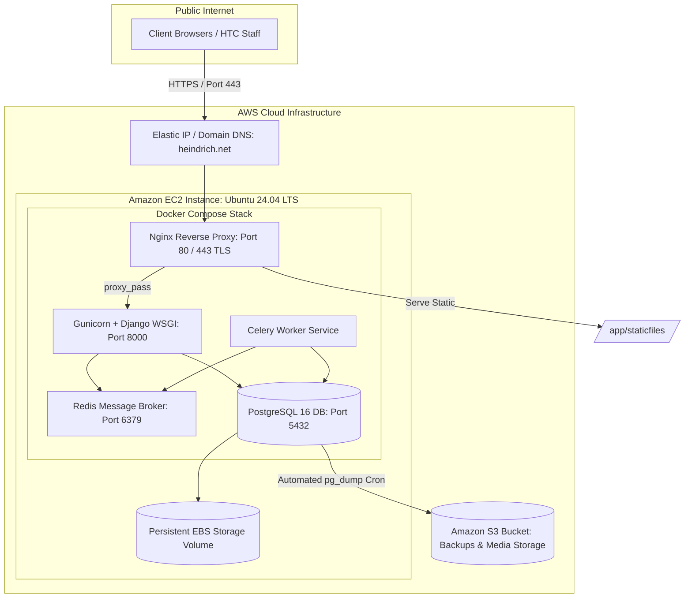

# HTC Core Phase 2 Architecture & Amazon EC2 Deployment Plan

This document outlines the current production architecture and deployment roadmap for HTC Core, aligning the containerized Django application with production hosting on **Amazon EC2 (AWS)**.

---

## 1. Current System Status Baseline

The repository currently implements a complete, containerized multi-service stack defined in [`docker-compose.yml`](../docker-compose.yml):

- **Nginx Reverse Proxy:** Serves as the public edge (Port 80/443) and static file server.
- **Gunicorn + Django Application:** Handles Web WSGI requests, database queries, and role-based management logic.
- **PostgreSQL 16 Database:** Primary relational store for transaction clusters, finance, masters, and append-only audit trails.
- **Redis Message Broker:** In-memory broker handling asynchronous task queues and Celery beat schedules.
- **Celery Worker & Scheduler:** Asynchronous task runner for background jobs (e.g. nightly loan status refresh).
- **Authentication & Approval Gating:** Multi-role RBAC (`ADMINISTRATOR`, `FINANCE`, `OPERATIONS_MANAGEMENT`, `INVOICING`) with secure employee sign-up gating and Admin Approval workflows.

---

## 2. Phase 2 Target Architecture (Amazon EC2 Production Deployment)

```mermaid
flowchart TD
    subgraph Internet [Public Internet]
        Users[Client Browsers / HTC Staff]
    end

    subgraph AWS [AWS Cloud Infrastructure]
        EIP[Elastic IP / Domain DNS: heindrich.net]
        
        subgraph EC2 [Amazon EC2 Instance: Ubuntu 24.04 LTS]
            subgraph DockerStack [Docker Compose Stack]
                Nginx[Nginx Reverse Proxy: Port 80 / 443 TLS]
                Gunicorn[Gunicorn + Django WSGI: Port 8000]
                CeleryWorker[Celery Worker Service]
                Redis[Redis Message Broker: Port 6379]
                Postgres[(PostgreSQL 16 DB: Port 5432)]
            end
            EBS[(Persistent EBS Storage Volume)]
        end

        S3[(Amazon S3 Bucket: Backups & Media Storage)]
    end

    Users -->|HTTPS / Port 443| EIP
    EIP --> Nginx
    Nginx -->|proxy_pass| Gunicorn
    Nginx -->|Serve Static| StaticVolume[/app/staticfiles/]
    Gunicorn --> Postgres
    Gunicorn --> Redis
    CeleryWorker --> Redis
    CeleryWorker --> Postgres
    Postgres -->|Automated pg_dump Cron| S3
    Postgres --> EBS
```

---

## 3. EC2 Production Deployment Roadmap

| Deployment Phase | Action Item | Description & Target Files |
| :--- | :--- | :--- |
| **Phase 2.1: Host Provisioning** | **Amazon EC2 Setup** | Launch Ubuntu 24.04 LTS instance (`t3.small` or `t3.medium`). Attach Elastic IP (EIP) and configure Security Group rules (`22` SSH, `80` HTTP, `443` HTTPS). |
| **Phase 2.2: Secrets Management** | **Production Env Config** | Configure production environment file [`.env.production`](../.env.production.example) with strong database passwords, unique `SECRET_KEY`, `DEBUG=False`, and custom `ALLOWED_HOSTS`. |
| **Phase 2.3: Domain & TLS/SSL** | **Nginx & Certbot** | Map domain DNS records to EC2 Elastic IP and install Let's Encrypt / Certbot SSL certificates for HTTPS encryption in [`nginx/nginx.conf`](../nginx/nginx.conf). |
| **Phase 2.4: Deployment Automation** | **EC2 Deploy Script** | Execute [`scripts/deploy_ec2.sh`](../scripts/deploy_ec2.sh) on host to pull updates, build containers, run `python manage.py migrate`, bundle `collectstatic`, and restart services cleanly. |
| **Phase 2.5: Persistence & Backups** | **EBS & S3 Storage** | Bind Docker data volumes (`postgres_data`, `media_volume`) to persistent EBS storage and run automated `pg_dump` backup cron scripts uploading database dumps to Amazon S3. |

---

## 4. File Reference

| File | Purpose |
| :--- | :--- |
| [`docker-compose.yml`](../docker-compose.yml) | Multi-container stack (db, redis, web, nginx, celery_worker) |
| [`Dockerfile`](../Dockerfile) | Production Python 3.12 build image |
| [`nginx/nginx.conf`](../nginx/nginx.conf) | Edge proxy routing and static asset serving |
| [`config/settings.py`](../config/settings.py) | Production security hardening settings (`SECURE_SSL_REDIRECT`, `SESSION_COOKIE_HTTPONLY`, Celery config) |
| [`scripts/deploy_ec2.sh`](../scripts/deploy_ec2.sh) | Amazon EC2 deployment script |
| [`.env.production.example`](../.env.production.example) | Production environment variable template |